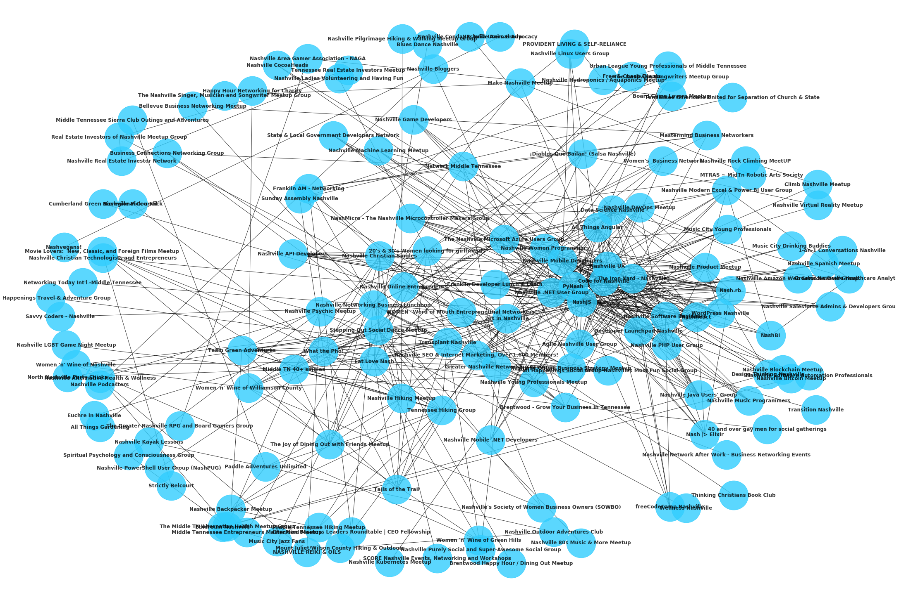
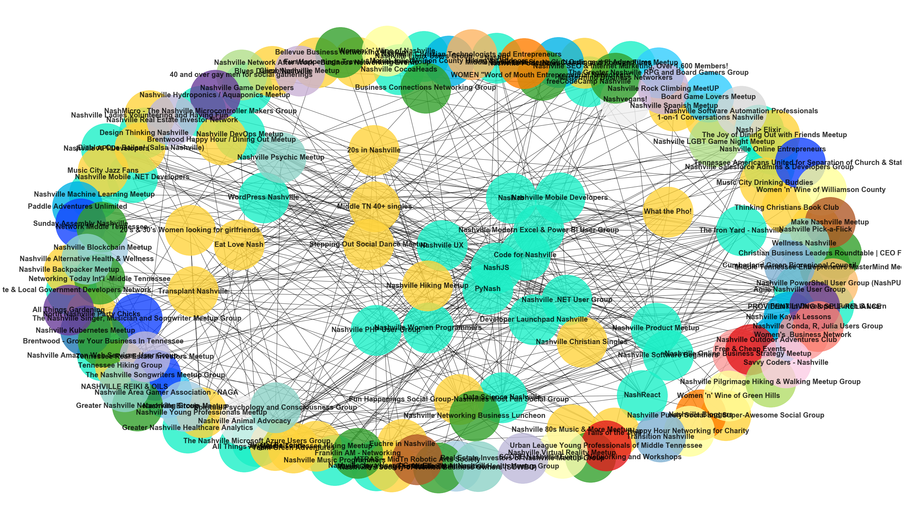

# Community Detection - Lab

## Introduction

In this lab, you'll once again work to cluster a network dataset. This time, you'll be investigating a [Meetup](https://www.meetup.com/) dataset for events occurring in Nashville.

## Objectives

You will be able to: 

- Make visualizations of clusters and gain insights about how the clusters have formed 
- Cluster a real-life social network dataset to detect communities within the network  


## Load the Dataset

To get started, load the dataset `'nashville-meetup/group-edges.csv'` as a pandas Dataframe. 


```python
import pandas as pd
groups = pd.read_csv('nashville-meetup/group-edges.csv', index_col=0)
groups.head()
```


<div>
<style scoped>
    .dataframe tbody tr th:only-of-type {
        vertical-align: middle;
    }

    .dataframe tbody tr th {
        vertical-align: top;
    }

    .dataframe thead th {
        text-align: right;
    }
</style>
<table border="1" class="dataframe">
  <thead>
    <tr style="text-align: right;">
      <th></th>
      <th>group1</th>
      <th>group2</th>
      <th>weight</th>
    </tr>
  </thead>
  <tbody>
    <tr>
      <th>0</th>
      <td>19292162</td>
      <td>535553</td>
      <td>2</td>
    </tr>
    <tr>
      <th>1</th>
      <td>19292162</td>
      <td>19194894</td>
      <td>1</td>
    </tr>
    <tr>
      <th>2</th>
      <td>19292162</td>
      <td>19728145</td>
      <td>1</td>
    </tr>
    <tr>
      <th>3</th>
      <td>19292162</td>
      <td>18850080</td>
      <td>2</td>
    </tr>
    <tr>
      <th>4</th>
      <td>19292162</td>
      <td>1728035</td>
      <td>1</td>
    </tr>
  </tbody>
</table>
</div>


To add some descriptive data, import the file `'nashville-meetup/meta-groups.csv'`.


```python
groups_meta = pd.read_csv('nashville-meetup/meta-groups.csv')
groups_meta.head()
```


<div>
<style scoped>
    .dataframe tbody tr th:only-of-type {
        vertical-align: middle;
    }

    .dataframe tbody tr th {
        vertical-align: top;
    }

    .dataframe thead th {
        text-align: right;
    }
</style>
<table border="1" class="dataframe">
  <thead>
    <tr style="text-align: right;">
      <th></th>
      <th>group_id</th>
      <th>group_name</th>
      <th>num_members</th>
      <th>category_id</th>
      <th>category_name</th>
      <th>organizer_id</th>
      <th>group_urlname</th>
    </tr>
  </thead>
  <tbody>
    <tr>
      <th>0</th>
      <td>339011</td>
      <td>Nashville Hiking Meetup</td>
      <td>15838</td>
      <td>23</td>
      <td>Outdoors &amp; Adventure</td>
      <td>4353803</td>
      <td>nashville-hiking</td>
    </tr>
    <tr>
      <th>1</th>
      <td>19728145</td>
      <td>Stepping Out Social Dance Meetup</td>
      <td>1778</td>
      <td>5</td>
      <td>Dancing</td>
      <td>118484462</td>
      <td>steppingoutsocialdance</td>
    </tr>
    <tr>
      <th>2</th>
      <td>6335372</td>
      <td>Nashville soccer</td>
      <td>2869</td>
      <td>32</td>
      <td>Sports &amp; Recreation</td>
      <td>108448302</td>
      <td>Nashville-soccer</td>
    </tr>
    <tr>
      <th>3</th>
      <td>10016242</td>
      <td>NashJS</td>
      <td>1975</td>
      <td>34</td>
      <td>Tech</td>
      <td>8111102</td>
      <td>nashjs</td>
    </tr>
    <tr>
      <th>4</th>
      <td>21174496</td>
      <td>20's &amp; 30's Women looking for girlfriends</td>
      <td>2782</td>
      <td>31</td>
      <td>Socializing</td>
      <td>184580248</td>
      <td>new-friends-in-Nashville</td>
    </tr>
  </tbody>
</table>
</div>


## Transform to a Network Representation

Take the Pandas DataFrame and transform it into a graph representation via NetworkX. Make nodes the names of the various groups within the Nashville area. The edges should be the weights between these groups.


```python
import networkx as nx

group_dict = dict(zip(groups_meta.group_id, groups_meta.group_name))
G = nx.Graph()
for row in groups.index:
    g1 = group_dict[groups.group1[row]]
    g2 = group_dict[groups.group2[row]]
    weight = groups.weight[row]
    G.add_edge(g1, g2, weight=weight)
```

## Visualize the Network


```python
import matplotlib.pyplot as plt
%matplotlib inline

nx.draw(G, pos=nx.spring_layout(G, k=2, seed=5), alpha=.8, node_color='#32cefe')
```

    //anaconda3/lib/python3.7/site-packages/networkx/drawing/nx_pylab.py:579: MatplotlibDeprecationWarning: 
    The iterable function was deprecated in Matplotlib 3.1 and will be removed in 3.3. Use np.iterable instead.
      if not cb.iterable(width):


## Refine the Visual

As you should see, the initial visualization is a globular mess! Refine the visualization to better picture the center core of the  network.


```python
for i in range(0,100,5):
    print('{}th percentile: {}'.format(i,groups.weight.quantile(q=i/100)))
```

    0th percentile: 1.0
    5th percentile: 1.0
    10th percentile: 1.0
    15th percentile: 1.0
    20th percentile: 1.0
    25th percentile: 1.0
    30th percentile: 1.0
    35th percentile: 1.0
    40th percentile: 1.0
    45th percentile: 1.0
    50th percentile: 1.0
    55th percentile: 1.0
    60th percentile: 1.0
    65th percentile: 1.0
    70th percentile: 2.0
    75th percentile: 2.0
    80th percentile: 2.0
    85th percentile: 3.0
    90th percentile: 4.0
    95th percentile: 7.0


```python
threshold = 5
G_subset = nx.Graph()
for row in groups.index:
    g1 = group_dict[groups.group1[row]]
    g2 = group_dict[groups.group2[row]]
    weight = groups.weight[row]
    if weight > threshold:
        G_subset.add_edge(g1, g2, weight=weight)
plt.figure(figsize=(30,20))
nx.draw(G_subset, pos=nx.spring_layout(G_subset, k=2, seed=5),
        alpha=.8, node_color='#32cefe', node_size=5000,
        with_labels=True, font_size=12, font_weight='bold')
```


```python
len(G_subset)
```


    146


## Cluster the Network

Now, that the dataset is a little more manageable, try clustering the remaining group nodes.


```python
gn_clusters = list(nx.algorithms.community.centrality.girvan_newman(G_subset))
for n, clusters in enumerate(gn_clusters):
    print('After removing {} edges, there are {} clusters.'.format(n, len(clusters)))
```

    After removing 0 edges, there are 7 clusters.
    After removing 1 edges, there are 8 clusters.
    After removing 2 edges, there are 9 clusters.
    After removing 3 edges, there are 10 clusters.
    After removing 4 edges, there are 11 clusters.
    After removing 5 edges, there are 12 clusters.
    After removing 6 edges, there are 13 clusters.
    After removing 7 edges, there are 14 clusters.
    After removing 8 edges, there are 15 clusters.
    After removing 9 edges, there are 16 clusters.
    After removing 10 edges, there are 17 clusters.
    After removing 11 edges, there are 18 clusters.
    After removing 12 edges, there are 19 clusters.
    After removing 13 edges, there are 20 clusters.
    After removing 14 edges, there are 21 clusters.
    After removing 15 edges, there are 22 clusters.
    After removing 16 edges, there are 23 clusters.
    After removing 17 edges, there are 24 clusters.
    After removing 18 edges, there are 25 clusters.
    After removing 19 edges, there are 26 clusters.
    After removing 20 edges, there are 27 clusters.
    After removing 21 edges, there are 28 clusters.
    After removing 22 edges, there are 29 clusters.
    After removing 23 edges, there are 30 clusters.
    After removing 24 edges, there are 31 clusters.
    After removing 25 edges, there are 32 clusters.
    After removing 26 edges, there are 33 clusters.
    After removing 27 edges, there are 34 clusters.
    After removing 28 edges, there are 35 clusters.
    After removing 29 edges, there are 36 clusters.
    After removing 30 edges, there are 37 clusters.
    After removing 31 edges, there are 38 clusters.
    After removing 32 edges, there are 39 clusters.
    After removing 33 edges, there are 40 clusters.
    After removing 34 edges, there are 41 clusters.
    After removing 35 edges, there are 42 clusters.
    After removing 36 edges, there are 43 clusters.
    After removing 37 edges, there are 44 clusters.
    After removing 38 edges, there are 45 clusters.
    After removing 39 edges, there are 46 clusters.
    After removing 40 edges, there are 47 clusters.
    After removing 41 edges, there are 48 clusters.
    After removing 42 edges, there are 49 clusters.
    After removing 43 edges, there are 50 clusters.
    After removing 44 edges, there are 51 clusters.
    After removing 45 edges, there are 52 clusters.
    After removing 46 edges, there are 53 clusters.
    After removing 47 edges, there are 54 clusters.
    After removing 48 edges, there are 55 clusters.
    After removing 49 edges, there are 56 clusters.
    After removing 50 edges, there are 57 clusters.
    After removing 51 edges, there are 58 clusters.
    After removing 52 edges, there are 59 clusters.
    After removing 53 edges, there are 60 clusters.
    After removing 54 edges, there are 61 clusters.
    After removing 55 edges, there are 62 clusters.
    After removing 56 edges, there are 63 clusters.
    After removing 57 edges, there are 64 clusters.
    After removing 58 edges, there are 65 clusters.
    After removing 59 edges, there are 66 clusters.
    After removing 60 edges, there are 67 clusters.
    After removing 61 edges, there are 68 clusters.
    After removing 62 edges, there are 69 clusters.
    After removing 63 edges, there are 70 clusters.
    After removing 64 edges, there are 71 clusters.
    After removing 65 edges, there are 72 clusters.
    After removing 66 edges, there are 73 clusters.
    After removing 67 edges, there are 74 clusters.
    After removing 68 edges, there are 75 clusters.
    After removing 69 edges, there are 76 clusters.
    After removing 70 edges, there are 77 clusters.
    After removing 71 edges, there are 78 clusters.
    After removing 72 edges, there are 79 clusters.
    After removing 73 edges, there are 80 clusters.
    After removing 74 edges, there are 81 clusters.
    After removing 75 edges, there are 82 clusters.
    After removing 76 edges, there are 83 clusters.
    After removing 77 edges, there are 84 clusters.
    After removing 78 edges, there are 85 clusters.
    After removing 79 edges, there are 86 clusters.
    After removing 80 edges, there are 87 clusters.
    After removing 81 edges, there are 88 clusters.
    After removing 82 edges, there are 89 clusters.
    After removing 83 edges, there are 90 clusters.
    After removing 84 edges, there are 91 clusters.
    After removing 85 edges, there are 92 clusters.
    After removing 86 edges, there are 93 clusters.
    After removing 87 edges, there are 94 clusters.
    After removing 88 edges, there are 95 clusters.
    After removing 89 edges, there are 96 clusters.
    After removing 90 edges, there are 97 clusters.
    After removing 91 edges, there are 98 clusters.
    After removing 92 edges, there are 99 clusters.
    After removing 93 edges, there are 100 clusters.
    After removing 94 edges, there are 101 clusters.
    After removing 95 edges, there are 102 clusters.
    After removing 96 edges, there are 103 clusters.
    After removing 97 edges, there are 104 clusters.
    After removing 98 edges, there are 105 clusters.
    After removing 99 edges, there are 106 clusters.
    After removing 100 edges, there are 107 clusters.
    After removing 101 edges, there are 108 clusters.
    After removing 102 edges, there are 109 clusters.
    After removing 103 edges, there are 110 clusters.
    After removing 104 edges, there are 111 clusters.
    After removing 105 edges, there are 112 clusters.
    After removing 106 edges, there are 113 clusters.
    After removing 107 edges, there are 114 clusters.
    After removing 108 edges, there are 115 clusters.
    After removing 109 edges, there are 116 clusters.
    After removing 110 edges, there are 117 clusters.
    After removing 111 edges, there are 118 clusters.
    After removing 112 edges, there are 119 clusters.
    After removing 113 edges, there are 120 clusters.
    After removing 114 edges, there are 121 clusters.
    After removing 115 edges, there are 122 clusters.
    After removing 116 edges, there are 123 clusters.
    After removing 117 edges, there are 124 clusters.
    After removing 118 edges, there are 125 clusters.
    After removing 119 edges, there are 126 clusters.
    After removing 120 edges, there are 127 clusters.
    After removing 121 edges, there are 128 clusters.
    After removing 122 edges, there are 129 clusters.
    After removing 123 edges, there are 130 clusters.
    After removing 124 edges, there are 131 clusters.
    After removing 125 edges, there are 132 clusters.
    After removing 126 edges, there are 133 clusters.
    After removing 127 edges, there are 134 clusters.
    After removing 128 edges, there are 135 clusters.
    After removing 129 edges, there are 136 clusters.
    After removing 130 edges, there are 137 clusters.
    After removing 131 edges, there are 138 clusters.
    After removing 132 edges, there are 139 clusters.
    After removing 133 edges, there are 140 clusters.
    After removing 134 edges, there are 141 clusters.
    After removing 135 edges, there are 142 clusters.
    After removing 136 edges, there are 143 clusters.
    After removing 137 edges, there are 144 clusters.
    After removing 138 edges, there are 145 clusters.
    After removing 139 edges, there are 146 clusters.


## Determine An Optimal Clustering Schema

Finally, determine a final clustering organization.


```python
import numpy as np
import seaborn as sns
sns.set_style('darkgrid')
colors = ['#1cf0c7','#ffd43d','#00b3e6','#32cefe','#efefef',
          '#1443ff','#a6cee3','#1f78b4','#b2df8a','#33a02c','#fb9a99',
          '#e31a1c','#fdbf6f','#ff7f00','#cab2d6','#6a3d9a','#ffff99',
          '#b15928','#8dd3c7','#ffffb3','#bebada','#fb8072','#80b1d3',
          '#fdb462','#b3de69','#fccde5','#d9d9d9','#bc80bd','#ccebc5',
          '#ffed6f','#bf812d','#dfc27d','#f6e8c3','#f5f5f5','#c7eae5',
          '#80cdc1', '#35978f', '#01665e', '#003c30']

fig = plt.figure(figsize=(12,10))

x = [n+1 for n in range(len(gn_clusters))]

max_cluster_size = [max([len(c) for c in cluster]) for cluster in gn_clusters]
plt.plot(x,max_cluster_size, color=colors[0], label='Max Cluster Size')

min_cluster_size = [min([len(c) for c in cluster]) for cluster in gn_clusters]
plt.plot(x,min_cluster_size, color=colors[1], label='Minimum Cluster Size')

mean_cluster_size = [np.mean([len(c) for c in cluster]) for cluster in gn_clusters]
plt.plot(x,mean_cluster_size, color=colors[2], label='Mean Cluster Size')

median_cluster_size = [np.median([len(c) for c in cluster]) for cluster in gn_clusters]
plt.plot(x,median_cluster_size, color=colors[3], label='Median Cluster Size')

single_node_clusters = [sum([1 if len(c)==1 else 0 for c in cluster]) for cluster in gn_clusters]
plt.plot(x,single_node_clusters, color=colors[6], label='Number of Single Node Clusters')

small_clusters = [sum([1 if len(c)<=5 else 0 for c in cluster ]) for cluster in gn_clusters]
plt.plot(x,small_clusters, color=colors[5], label='Number of Small Clusters (5 or less nodes)')

plt.legend(loc=(1.01,.75), fontsize=14)
plt.title('Cluster Size Metrics versus Number of Edges Removed', fontsize=14)
plt.xlabel('Number of Edges Removed', fontsize=14)
plt.ylabel('Cluster Metric')
plt.ylim(0,80)
plt.yticks(ticks=list(range(0,80,5)))
plt.show()
```





## Visualize the Clusters

Analyze the output of your clustering schema. Do any clusters of groups stand out to you?


```python
def plot_girvan_newman(G, clusters):
    #Your code here
    fig = plt.figure(figsize=(35,20))
    colors = ['#1cf0c7','#ffd43d','#00b3e6','#32cefe','#efefef',
              '#1443ff','#a6cee3','#1f78b4','#b2df8a','#33a02c','#fb9a99',
              '#e31a1c','#fdbf6f','#ff7f00','#cab2d6','#6a3d9a','#ffff99',
              '#b15928','#8dd3c7','#ffffb3','#bebada','#fb8072','#80b1d3',
              '#fdb462','#b3de69','#fccde5','#d9d9d9','#bc80bd','#ccebc5',
              '#ffed6f','#bf812d','#dfc27d','#f6e8c3','#f5f5f5','#c7eae5',
              '#80cdc1', '#35978f', '#01665e', '#003c30']
    for n , c in enumerate(clusters):
        ci = G.subgraph(c)
        nx.draw(ci, pos=nx.spring_layout(G_subset, k=3.6, seed=3), with_labels=True, node_color=colors[n],
                alpha=0.8, node_size=20000, font_weight='bold', font_size=20)
    plt.show()
sns.set_style('white')
plot_girvan_newman(G_subset, gn_clusters[20])
```

    //anaconda3/lib/python3.7/site-packages/networkx/drawing/nx_pylab.py:579: MatplotlibDeprecationWarning: 
    The iterable function was deprecated in Matplotlib 3.1 and will be removed in 3.3. Use np.iterable instead.
      if not cb.iterable(width):





```python
# Because the Network is still dense and names are long, organizing the clusters as a Pandas dataframe is appropriate
clusters = pd.DataFrame(gn_clusters[20]).transpose()
clusters.columns = ['Cluster{}'.format(i) for i in range(1,len(clusters.columns)+1)]
clusters

# Many of the clusters are easily identifiable;
# You can see that cluster 1 is a technology group,
# cluster 2 is a social hodgepodge,
# cluster3 is outdoor enthusiasts,
# cluster4 is gamers, and so forth
```


<div>
<style scoped>
    .dataframe tbody tr th:only-of-type {
        vertical-align: middle;
    }

    .dataframe tbody tr th {
        vertical-align: top;
    }

    .dataframe thead th {
        text-align: right;
    }
</style>
<table border="1" class="dataframe">
  <thead>
    <tr style="text-align: right;">
      <th></th>
      <th>Cluster1</th>
      <th>Cluster2</th>
      <th>Cluster3</th>
      <th>Cluster4</th>
      <th>Cluster5</th>
      <th>Cluster6</th>
      <th>Cluster7</th>
      <th>Cluster8</th>
      <th>Cluster9</th>
      <th>Cluster10</th>
      <th>...</th>
      <th>Cluster18</th>
      <th>Cluster19</th>
      <th>Cluster20</th>
      <th>Cluster21</th>
      <th>Cluster22</th>
      <th>Cluster23</th>
      <th>Cluster24</th>
      <th>Cluster25</th>
      <th>Cluster26</th>
      <th>Cluster27</th>
    </tr>
  </thead>
  <tbody>
    <tr>
      <th>0</th>
      <td>Nashville CocoaHeads</td>
      <td>Fun Happenings Social Group-Nashvilles Most Fu...</td>
      <td>Mount Juliet/Wilson County Hiking &amp; Outdoors</td>
      <td>Board Game Lovers Meetup</td>
      <td>Nashville Animal Advocacy</td>
      <td>The Nashville Singer, Musician and Songwriter ...</td>
      <td>Ethereum Nashville</td>
      <td>Nashville Kubernetes Meetup</td>
      <td>40 and over gay men for social gatherings</td>
      <td>Business Connections Networking Group</td>
      <td>...</td>
      <td>MTRAS ~ MidTn Robotic Arts Society</td>
      <td>Spiritual Psychology and Consciousness Group</td>
      <td>Nashville Virtual Reality Meetup</td>
      <td>Tennessee Real Estate Investors Meetup</td>
      <td>Nashville Conda, R, Julia Users Group</td>
      <td>Cumberland Green Bioregional Council</td>
      <td>Nashville Christian Technologists and Entrepre...</td>
      <td>Nashville Pilgrimage Hiking &amp; Walking Meetup G...</td>
      <td>Savvy Coders - Nashville</td>
      <td>Nashville Software Automation Professionals</td>
    </tr>
    <tr>
      <th>1</th>
      <td>Nashville DevOps Meetup</td>
      <td>Transplant Nashville</td>
      <td>Middle Tennessee Sierra Club Outings and Adven...</td>
      <td>Nashville Area Gamer Association - NAGA</td>
      <td>Nashvegans!</td>
      <td>Sunday Assembly Nashville</td>
      <td>Nashville Blockchain Meetup</td>
      <td>None</td>
      <td>Nashville LGBT Game Night Meetup</td>
      <td>SCORE Nashville Events, Networking and Workshops</td>
      <td>...</td>
      <td>Make Nashville Meetup</td>
      <td>Nashville Psychic Meetup</td>
      <td>None</td>
      <td>Real Estate Investors of Nashville Meetup Group</td>
      <td>None</td>
      <td>Transition Nashville</td>
      <td>None</td>
      <td>None</td>
      <td>None</td>
      <td>None</td>
    </tr>
    <tr>
      <th>2</th>
      <td>Developer Launchpad Nashville</td>
      <td>1-on-1 Conversations Nashville</td>
      <td>Nashville Kayak Lessons</td>
      <td>The Greater Nashville RPG and Board Gamers Group</td>
      <td>None</td>
      <td>Tennessee Americans United for Separation of C...</td>
      <td>Nashville Bitcoin Meetup</td>
      <td>None</td>
      <td>None</td>
      <td>Nashville's Society of Women Business Owners (...</td>
      <td>...</td>
      <td>None</td>
      <td>NASHVILLE REIKI &amp; OILS</td>
      <td>None</td>
      <td>Nashville Real Estate Investor Network</td>
      <td>None</td>
      <td>None</td>
      <td>None</td>
      <td>None</td>
      <td>None</td>
      <td>None</td>
    </tr>
    <tr>
      <th>3</th>
      <td>Nashville Product Meetup</td>
      <td>Nashville Hiking Meetup</td>
      <td>Paddle Adventures Unlimited</td>
      <td>None</td>
      <td>None</td>
      <td>The Nashville Songwriters Meetup Group</td>
      <td>None</td>
      <td>None</td>
      <td>None</td>
      <td>Nashville Networking Business Luncheon</td>
      <td>...</td>
      <td>None</td>
      <td>Nashville Alternative Health &amp; Wellness</td>
      <td>None</td>
      <td>None</td>
      <td>None</td>
      <td>None</td>
      <td>None</td>
      <td>None</td>
      <td>None</td>
      <td>None</td>
    </tr>
    <tr>
      <th>4</th>
      <td>Nash.rb</td>
      <td>Nashville Young Professionals Meetup</td>
      <td>Nashville Outdoor Adventures Club</td>
      <td>None</td>
      <td>None</td>
      <td>None</td>
      <td>None</td>
      <td>None</td>
      <td>None</td>
      <td>WOMEN "Word of Mouth Entrepreneurial Networkers"</td>
      <td>...</td>
      <td>None</td>
      <td>Wellness Nashville</td>
      <td>None</td>
      <td>None</td>
      <td>None</td>
      <td>None</td>
      <td>None</td>
      <td>None</td>
      <td>None</td>
      <td>None</td>
    </tr>
    <tr>
      <th>5</th>
      <td>Nashville Java Users' Group</td>
      <td>Nashville Pick-a-Flick</td>
      <td>None</td>
      <td>None</td>
      <td>None</td>
      <td>None</td>
      <td>None</td>
      <td>None</td>
      <td>None</td>
      <td>Networking Today Int'l -Middle Tennessee</td>
      <td>...</td>
      <td>None</td>
      <td>The Middle TN Alternative Health Meetup Group</td>
      <td>None</td>
      <td>None</td>
      <td>None</td>
      <td>None</td>
      <td>None</td>
      <td>None</td>
      <td>None</td>
      <td>None</td>
    </tr>
    <tr>
      <th>6</th>
      <td>Greater Nashville Healthcare Analytics</td>
      <td>Fun Happenings Travel &amp; Adventure Group</td>
      <td>None</td>
      <td>None</td>
      <td>None</td>
      <td>None</td>
      <td>None</td>
      <td>None</td>
      <td>None</td>
      <td>Mastermind Business Networkers</td>
      <td>...</td>
      <td>None</td>
      <td>None</td>
      <td>None</td>
      <td>None</td>
      <td>None</td>
      <td>None</td>
      <td>None</td>
      <td>None</td>
      <td>None</td>
      <td>None</td>
    </tr>
    <tr>
      <th>7</th>
      <td>Nashville Game Developers</td>
      <td>Music City Jazz Fans</td>
      <td>None</td>
      <td>None</td>
      <td>None</td>
      <td>None</td>
      <td>None</td>
      <td>None</td>
      <td>None</td>
      <td>Christian Business Leaders Roundtable | CEO Fe...</td>
      <td>...</td>
      <td>None</td>
      <td>None</td>
      <td>None</td>
      <td>None</td>
      <td>None</td>
      <td>None</td>
      <td>None</td>
      <td>None</td>
      <td>None</td>
      <td>None</td>
    </tr>
    <tr>
      <th>8</th>
      <td>The Iron Yard - Nashville</td>
      <td>Nashville Backpacker Meetup</td>
      <td>None</td>
      <td>None</td>
      <td>None</td>
      <td>None</td>
      <td>None</td>
      <td>None</td>
      <td>None</td>
      <td>Middle Tennessee Entrepreneurs MasterMind Meetup</td>
      <td>...</td>
      <td>None</td>
      <td>None</td>
      <td>None</td>
      <td>None</td>
      <td>None</td>
      <td>None</td>
      <td>None</td>
      <td>None</td>
      <td>None</td>
      <td>None</td>
    </tr>
    <tr>
      <th>9</th>
      <td>Franklin Developer Lunch &amp; Learn</td>
      <td>Tails of the Trail</td>
      <td>None</td>
      <td>None</td>
      <td>None</td>
      <td>None</td>
      <td>None</td>
      <td>None</td>
      <td>None</td>
      <td>Brentwood - Grow Your Business In Tennessee</td>
      <td>...</td>
      <td>None</td>
      <td>None</td>
      <td>None</td>
      <td>None</td>
      <td>None</td>
      <td>None</td>
      <td>None</td>
      <td>None</td>
      <td>None</td>
      <td>None</td>
    </tr>
    <tr>
      <th>10</th>
      <td>Nashville Online Entrepreneurs</td>
      <td>Euchre in Nashville</td>
      <td>None</td>
      <td>None</td>
      <td>None</td>
      <td>None</td>
      <td>None</td>
      <td>None</td>
      <td>None</td>
      <td>Greater Nashville Networking Group</td>
      <td>...</td>
      <td>None</td>
      <td>None</td>
      <td>None</td>
      <td>None</td>
      <td>None</td>
      <td>None</td>
      <td>None</td>
      <td>None</td>
      <td>None</td>
      <td>None</td>
    </tr>
    <tr>
      <th>11</th>
      <td>PyNash</td>
      <td>20's &amp; 30's Women looking for girlfriends</td>
      <td>None</td>
      <td>None</td>
      <td>None</td>
      <td>None</td>
      <td>None</td>
      <td>None</td>
      <td>None</td>
      <td>Network Middle Tennessee</td>
      <td>...</td>
      <td>None</td>
      <td>None</td>
      <td>None</td>
      <td>None</td>
      <td>None</td>
      <td>None</td>
      <td>None</td>
      <td>None</td>
      <td>None</td>
      <td>None</td>
    </tr>
    <tr>
      <th>12</th>
      <td>Design Thinking Nashville</td>
      <td>What the Pho!</td>
      <td>None</td>
      <td>None</td>
      <td>None</td>
      <td>None</td>
      <td>None</td>
      <td>None</td>
      <td>None</td>
      <td>Bellevue Business Networking Meetup</td>
      <td>...</td>
      <td>None</td>
      <td>None</td>
      <td>None</td>
      <td>None</td>
      <td>None</td>
      <td>None</td>
      <td>None</td>
      <td>None</td>
      <td>None</td>
      <td>None</td>
    </tr>
    <tr>
      <th>13</th>
      <td>Nashville Women Programmers</td>
      <td>The Joy of Dining Out with Friends Meetup</td>
      <td>None</td>
      <td>None</td>
      <td>None</td>
      <td>None</td>
      <td>None</td>
      <td>None</td>
      <td>None</td>
      <td>Franklin AM - Networking</td>
      <td>...</td>
      <td>None</td>
      <td>None</td>
      <td>None</td>
      <td>None</td>
      <td>None</td>
      <td>None</td>
      <td>None</td>
      <td>None</td>
      <td>None</td>
      <td>None</td>
    </tr>
    <tr>
      <th>14</th>
      <td>Nashville Linux Users Group</td>
      <td>Music City Young Professionals</td>
      <td>None</td>
      <td>None</td>
      <td>None</td>
      <td>None</td>
      <td>None</td>
      <td>None</td>
      <td>None</td>
      <td>None</td>
      <td>...</td>
      <td>None</td>
      <td>None</td>
      <td>None</td>
      <td>None</td>
      <td>None</td>
      <td>None</td>
      <td>None</td>
      <td>None</td>
      <td>None</td>
      <td>None</td>
    </tr>
    <tr>
      <th>15</th>
      <td>Nashville UX</td>
      <td>Strictly Belcourt</td>
      <td>None</td>
      <td>None</td>
      <td>None</td>
      <td>None</td>
      <td>None</td>
      <td>None</td>
      <td>None</td>
      <td>None</td>
      <td>...</td>
      <td>None</td>
      <td>None</td>
      <td>None</td>
      <td>None</td>
      <td>None</td>
      <td>None</td>
      <td>None</td>
      <td>None</td>
      <td>None</td>
      <td>None</td>
    </tr>
    <tr>
      <th>16</th>
      <td>Data Science Nashville</td>
      <td>Nashville Spanish Meetup</td>
      <td>None</td>
      <td>None</td>
      <td>None</td>
      <td>None</td>
      <td>None</td>
      <td>None</td>
      <td>None</td>
      <td>None</td>
      <td>...</td>
      <td>None</td>
      <td>None</td>
      <td>None</td>
      <td>None</td>
      <td>None</td>
      <td>None</td>
      <td>None</td>
      <td>None</td>
      <td>None</td>
      <td>None</td>
    </tr>
    <tr>
      <th>17</th>
      <td>Nash |&gt; Elixir</td>
      <td>Nashville Ladies Volunteering and Having Fun</td>
      <td>None</td>
      <td>None</td>
      <td>None</td>
      <td>None</td>
      <td>None</td>
      <td>None</td>
      <td>None</td>
      <td>None</td>
      <td>...</td>
      <td>None</td>
      <td>None</td>
      <td>None</td>
      <td>None</td>
      <td>None</td>
      <td>None</td>
      <td>None</td>
      <td>None</td>
      <td>None</td>
      <td>None</td>
    </tr>
    <tr>
      <th>18</th>
      <td>NashJS</td>
      <td>Nashville Network After Work - Business Networ...</td>
      <td>None</td>
      <td>None</td>
      <td>None</td>
      <td>None</td>
      <td>None</td>
      <td>None</td>
      <td>None</td>
      <td>None</td>
      <td>...</td>
      <td>None</td>
      <td>None</td>
      <td>None</td>
      <td>None</td>
      <td>None</td>
      <td>None</td>
      <td>None</td>
      <td>None</td>
      <td>None</td>
      <td>None</td>
    </tr>
    <tr>
      <th>19</th>
      <td>Nashville PHP User Group</td>
      <td>Tennessee Hiking Group</td>
      <td>None</td>
      <td>None</td>
      <td>None</td>
      <td>None</td>
      <td>None</td>
      <td>None</td>
      <td>None</td>
      <td>None</td>
      <td>...</td>
      <td>None</td>
      <td>None</td>
      <td>None</td>
      <td>None</td>
      <td>None</td>
      <td>None</td>
      <td>None</td>
      <td>None</td>
      <td>None</td>
      <td>None</td>
    </tr>
    <tr>
      <th>20</th>
      <td>Nashville Software Beginners</td>
      <td>Thinking Christians Book Club</td>
      <td>None</td>
      <td>None</td>
      <td>None</td>
      <td>None</td>
      <td>None</td>
      <td>None</td>
      <td>None</td>
      <td>None</td>
      <td>...</td>
      <td>None</td>
      <td>None</td>
      <td>None</td>
      <td>None</td>
      <td>None</td>
      <td>None</td>
      <td>None</td>
      <td>None</td>
      <td>None</td>
      <td>None</td>
    </tr>
    <tr>
      <th>21</th>
      <td>Agile Nashville User Group</td>
      <td>20s in Nashville</td>
      <td>None</td>
      <td>None</td>
      <td>None</td>
      <td>None</td>
      <td>None</td>
      <td>None</td>
      <td>None</td>
      <td>None</td>
      <td>...</td>
      <td>None</td>
      <td>None</td>
      <td>None</td>
      <td>None</td>
      <td>None</td>
      <td>None</td>
      <td>None</td>
      <td>None</td>
      <td>None</td>
      <td>None</td>
    </tr>
    <tr>
      <th>22</th>
      <td>All Things Angular</td>
      <td>Movie Lovers:  New, Classic, and Foreign Films...</td>
      <td>None</td>
      <td>None</td>
      <td>None</td>
      <td>None</td>
      <td>None</td>
      <td>None</td>
      <td>None</td>
      <td>None</td>
      <td>...</td>
      <td>None</td>
      <td>None</td>
      <td>None</td>
      <td>None</td>
      <td>None</td>
      <td>None</td>
      <td>None</td>
      <td>None</td>
      <td>None</td>
      <td>None</td>
    </tr>
    <tr>
      <th>23</th>
      <td>freeCodeCamp Nashville</td>
      <td>North Nashville Party Chicks</td>
      <td>None</td>
      <td>None</td>
      <td>None</td>
      <td>None</td>
      <td>None</td>
      <td>None</td>
      <td>None</td>
      <td>None</td>
      <td>...</td>
      <td>None</td>
      <td>None</td>
      <td>None</td>
      <td>None</td>
      <td>None</td>
      <td>None</td>
      <td>None</td>
      <td>None</td>
      <td>None</td>
      <td>None</td>
    </tr>
    <tr>
      <th>24</th>
      <td>WordPress Nashville</td>
      <td>Eat Love Nash</td>
      <td>None</td>
      <td>None</td>
      <td>None</td>
      <td>None</td>
      <td>None</td>
      <td>None</td>
      <td>None</td>
      <td>None</td>
      <td>...</td>
      <td>None</td>
      <td>None</td>
      <td>None</td>
      <td>None</td>
      <td>None</td>
      <td>None</td>
      <td>None</td>
      <td>None</td>
      <td>None</td>
      <td>None</td>
    </tr>
    <tr>
      <th>25</th>
      <td>Nashville Salesforce Admins &amp; Developers Group</td>
      <td>Nashville 80s Music &amp; More Meetup</td>
      <td>None</td>
      <td>None</td>
      <td>None</td>
      <td>None</td>
      <td>None</td>
      <td>None</td>
      <td>None</td>
      <td>None</td>
      <td>...</td>
      <td>None</td>
      <td>None</td>
      <td>None</td>
      <td>None</td>
      <td>None</td>
      <td>None</td>
      <td>None</td>
      <td>None</td>
      <td>None</td>
      <td>None</td>
    </tr>
    <tr>
      <th>26</th>
      <td>Nashville Machine Learning Meetup</td>
      <td>Middle TN 40+ singles</td>
      <td>None</td>
      <td>None</td>
      <td>None</td>
      <td>None</td>
      <td>None</td>
      <td>None</td>
      <td>None</td>
      <td>None</td>
      <td>...</td>
      <td>None</td>
      <td>None</td>
      <td>None</td>
      <td>None</td>
      <td>None</td>
      <td>None</td>
      <td>None</td>
      <td>None</td>
      <td>None</td>
      <td>None</td>
    </tr>
    <tr>
      <th>27</th>
      <td>NashMicro - The Nashville Microcontroller Make...</td>
      <td>Team Green Adventures</td>
      <td>None</td>
      <td>None</td>
      <td>None</td>
      <td>None</td>
      <td>None</td>
      <td>None</td>
      <td>None</td>
      <td>None</td>
      <td>...</td>
      <td>None</td>
      <td>None</td>
      <td>None</td>
      <td>None</td>
      <td>None</td>
      <td>None</td>
      <td>None</td>
      <td>None</td>
      <td>None</td>
      <td>None</td>
    </tr>
    <tr>
      <th>28</th>
      <td>Nashville .NET User Group</td>
      <td>Stepping Out Social Dance Meetup</td>
      <td>None</td>
      <td>None</td>
      <td>None</td>
      <td>None</td>
      <td>None</td>
      <td>None</td>
      <td>None</td>
      <td>None</td>
      <td>...</td>
      <td>None</td>
      <td>None</td>
      <td>None</td>
      <td>None</td>
      <td>None</td>
      <td>None</td>
      <td>None</td>
      <td>None</td>
      <td>None</td>
      <td>None</td>
    </tr>
    <tr>
      <th>29</th>
      <td>Nashville Mobile .NET Developers</td>
      <td>Nashville Purely Social and Super-Awesome Soci...</td>
      <td>None</td>
      <td>None</td>
      <td>None</td>
      <td>None</td>
      <td>None</td>
      <td>None</td>
      <td>None</td>
      <td>None</td>
      <td>...</td>
      <td>None</td>
      <td>None</td>
      <td>None</td>
      <td>None</td>
      <td>None</td>
      <td>None</td>
      <td>None</td>
      <td>None</td>
      <td>None</td>
      <td>None</td>
    </tr>
    <tr>
      <th>30</th>
      <td>Nashville Music Programmers</td>
      <td>Middle Tennessee Hiking Meetup</td>
      <td>None</td>
      <td>None</td>
      <td>None</td>
      <td>None</td>
      <td>None</td>
      <td>None</td>
      <td>None</td>
      <td>None</td>
      <td>...</td>
      <td>None</td>
      <td>None</td>
      <td>None</td>
      <td>None</td>
      <td>None</td>
      <td>None</td>
      <td>None</td>
      <td>None</td>
      <td>None</td>
      <td>None</td>
    </tr>
    <tr>
      <th>31</th>
      <td>NashBI</td>
      <td>Music City Drinking Buddies</td>
      <td>None</td>
      <td>None</td>
      <td>None</td>
      <td>None</td>
      <td>None</td>
      <td>None</td>
      <td>None</td>
      <td>None</td>
      <td>...</td>
      <td>None</td>
      <td>None</td>
      <td>None</td>
      <td>None</td>
      <td>None</td>
      <td>None</td>
      <td>None</td>
      <td>None</td>
      <td>None</td>
      <td>None</td>
    </tr>
    <tr>
      <th>32</th>
      <td>State &amp; Local Government Developers Network</td>
      <td>Nashville Christian Singles</td>
      <td>None</td>
      <td>None</td>
      <td>None</td>
      <td>None</td>
      <td>None</td>
      <td>None</td>
      <td>None</td>
      <td>None</td>
      <td>...</td>
      <td>None</td>
      <td>None</td>
      <td>None</td>
      <td>None</td>
      <td>None</td>
      <td>None</td>
      <td>None</td>
      <td>None</td>
      <td>None</td>
      <td>None</td>
    </tr>
    <tr>
      <th>33</th>
      <td>The Nashville Microsoft Azure Users Group</td>
      <td>¡Diablos Que Bailan! (Salsa Nashville)</td>
      <td>None</td>
      <td>None</td>
      <td>None</td>
      <td>None</td>
      <td>None</td>
      <td>None</td>
      <td>None</td>
      <td>None</td>
      <td>...</td>
      <td>None</td>
      <td>None</td>
      <td>None</td>
      <td>None</td>
      <td>None</td>
      <td>None</td>
      <td>None</td>
      <td>None</td>
      <td>None</td>
      <td>None</td>
    </tr>
    <tr>
      <th>34</th>
      <td>Nashville Modern Excel &amp; Power BI User Group</td>
      <td>Blues Dance Nashville</td>
      <td>None</td>
      <td>None</td>
      <td>None</td>
      <td>None</td>
      <td>None</td>
      <td>None</td>
      <td>None</td>
      <td>None</td>
      <td>...</td>
      <td>None</td>
      <td>None</td>
      <td>None</td>
      <td>None</td>
      <td>None</td>
      <td>None</td>
      <td>None</td>
      <td>None</td>
      <td>None</td>
      <td>None</td>
    </tr>
    <tr>
      <th>35</th>
      <td>Nashville Mobile Developers</td>
      <td>Brentwood Happy Hour / Dining Out Meetup</td>
      <td>None</td>
      <td>None</td>
      <td>None</td>
      <td>None</td>
      <td>None</td>
      <td>None</td>
      <td>None</td>
      <td>None</td>
      <td>...</td>
      <td>None</td>
      <td>None</td>
      <td>None</td>
      <td>None</td>
      <td>None</td>
      <td>None</td>
      <td>None</td>
      <td>None</td>
      <td>None</td>
      <td>None</td>
    </tr>
    <tr>
      <th>36</th>
      <td>Nashville Amazon Web Services User Group</td>
      <td>None</td>
      <td>None</td>
      <td>None</td>
      <td>None</td>
      <td>None</td>
      <td>None</td>
      <td>None</td>
      <td>None</td>
      <td>None</td>
      <td>...</td>
      <td>None</td>
      <td>None</td>
      <td>None</td>
      <td>None</td>
      <td>None</td>
      <td>None</td>
      <td>None</td>
      <td>None</td>
      <td>None</td>
      <td>None</td>
    </tr>
    <tr>
      <th>37</th>
      <td>Nashville SEO &amp; Internet Marketing, Over 1,600...</td>
      <td>None</td>
      <td>None</td>
      <td>None</td>
      <td>None</td>
      <td>None</td>
      <td>None</td>
      <td>None</td>
      <td>None</td>
      <td>None</td>
      <td>...</td>
      <td>None</td>
      <td>None</td>
      <td>None</td>
      <td>None</td>
      <td>None</td>
      <td>None</td>
      <td>None</td>
      <td>None</td>
      <td>None</td>
      <td>None</td>
    </tr>
    <tr>
      <th>38</th>
      <td>Code for Nashville</td>
      <td>None</td>
      <td>None</td>
      <td>None</td>
      <td>None</td>
      <td>None</td>
      <td>None</td>
      <td>None</td>
      <td>None</td>
      <td>None</td>
      <td>...</td>
      <td>None</td>
      <td>None</td>
      <td>None</td>
      <td>None</td>
      <td>None</td>
      <td>None</td>
      <td>None</td>
      <td>None</td>
      <td>None</td>
      <td>None</td>
    </tr>
    <tr>
      <th>39</th>
      <td>Nashville API Developers</td>
      <td>None</td>
      <td>None</td>
      <td>None</td>
      <td>None</td>
      <td>None</td>
      <td>None</td>
      <td>None</td>
      <td>None</td>
      <td>None</td>
      <td>...</td>
      <td>None</td>
      <td>None</td>
      <td>None</td>
      <td>None</td>
      <td>None</td>
      <td>None</td>
      <td>None</td>
      <td>None</td>
      <td>None</td>
      <td>None</td>
    </tr>
    <tr>
      <th>40</th>
      <td>NashReact</td>
      <td>None</td>
      <td>None</td>
      <td>None</td>
      <td>None</td>
      <td>None</td>
      <td>None</td>
      <td>None</td>
      <td>None</td>
      <td>None</td>
      <td>...</td>
      <td>None</td>
      <td>None</td>
      <td>None</td>
      <td>None</td>
      <td>None</td>
      <td>None</td>
      <td>None</td>
      <td>None</td>
      <td>None</td>
      <td>None</td>
    </tr>
  </tbody>
</table>
<p>41 rows × 27 columns</p>
</div>


## Summary

In this lab, you got another chance to practice your network clustering skills, investigating a meetup dataset of events and groups surrounding the Nashville area. If you're up for the challenge, feel free to continue investigating the dataset and trying to cluster users or events!                                                                                                                                                               
